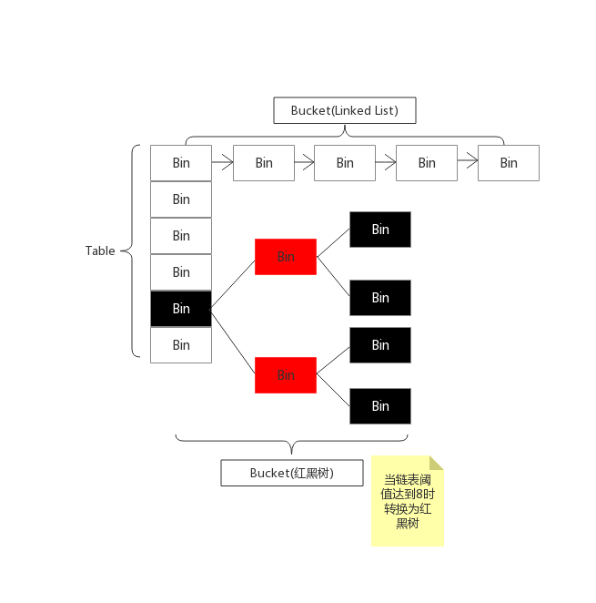
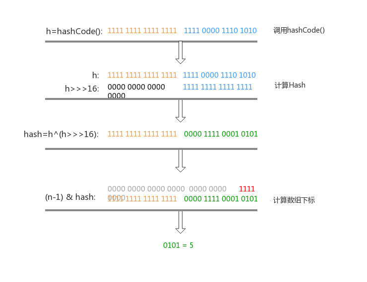

[toc]
# HashMap

## 简介     
基于哈希表的 Map 接口的实现。此实现提供所有可选的映射操作，并允许使用 null 值和 null 键。（除了非同步和允许使用 null 之外，HashMap 类与 Hashtable 大致相同。）此类不保证映射的顺序，特别是它不保证该顺序恒久不变。 此实现假定哈希函数将元素适当地分布在各桶之间，可为基本操作（get 和 put）提供稳定的性能。迭代 collection 视图所需的时间与 HashMap 实例的“容量”（桶的数量）及其大小（键-值映射关系数）成比例。所以，如果迭代性能很重要，则不要将初始容量设置得太高（或将加载因子设置得太低）。  

——摘自百度百科

## 底层数据结构分析
在java中，散列表用**链表数组**实现，每个列表称为**桶(bucket）**。要想查找表中对象的位置，就要先计算他的散列码，然后与桶的总数取余，所得到的结果就是保存这个元素的桶的索引。例如，如果某个对象的散列码为76268，并且有128个桶，对象应该保存在第108号桶中(76268除以128余108).


### 类的属性
```java
public class HashMap<K,V> extends AbstractMap<K,V>
    implements Map<K,V>, Cloneable, Serializable {

    private static final long serialVersionUID = 362498820763181265L;
    //默认的初始容量 16 
    static final int DEFAULT_INITIAL_CAPACITY = 1 << 4; // aka 16
    //最大容量 必须<=1<<3
    static final int MAXIMUM_CAPACITY = 1 << 30;
    //默认的加载因子
    static final float DEFAULT_LOAD_FACTOR = 0.75f;
    //阈值当桶(bucket)上的节点数大于这个值就会从链表转换为红黑树 默认为8
    static final int TREEIFY_THRESHOLD = 8;
    //当桶(bucket)的节点数小于这个值会从红黑树转换为链表
    static final int UNTREEIFY_THRESHOLD = 6;
    //转化为红黑树对应的键值对的最小值
    static final int MIN_TREEIFY_CAPACITY = 64;
    //存储元素的数组(总是2的幂次倍)
    transient Node<K,V>[] table;
    //存放具体元素的集
    transient Set<Map.Entry<K,V>> entrySet;
    //存放键值对的个数
    transient int size;
    //每次扩容和修改map结构的计数器
    transient int modCount;
    //临界值 当实际大小(容量*加载因子)超过临界值时，会进行扩容
    int threshold;
    //加载因子
    final float loadFactor;
```
- **loadFactor加载因子**
加载因子是表示Hash表中元素的填满程度。若加载因子越大，填满的元素越多，好处是空间利用率高了，但是==冲突的机会==加大了。反之，加载因子越小，填满的元素越少，空间浪费，==冲突机会==减小了。这里默认值是==0.75==,是一个比较好的临界值。

给定的默认容量(DEFAULT_INITIAL_CAPACITY)为==16==,加载因子为==0.75==。当Map元素的数量达到了==12(16*0.75)== 就需要进行扩容。
- **threshold**
**threshold=capacity*loadFactor** 当Size>=threshold的时候，就考虑对数组进行扩增。是一个临界值
- **Node<K,V>[] table**
这里的数组长度应该是2的幂次倍。后面会说到
### Node节点类
```java
    static class Node<K,V> implements Map.Entry<K,V> {
        final int hash;  //哈希值
        final K key;    //键  
        V value;    //值
        Node<K,V> next;  //指向下一个节点

        Node(int hash, K key, V value, Node<K,V> next) {
            this.hash = hash;
            this.key = key;
            this.value = value;
            this.next = next;
        }

        public final K getKey()        { return key; }
        public final V getValue()      { return value; }
        public final String toString() { return key + "=" + value; }
        //重写hashCode()方法
        public final int hashCode() {
            return Objects.hashCode(key) ^ Objects.hashCode(value);
        }

        public final V setValue(V newValue) {
            V oldValue = value;
            value = newValue;
            return oldValue;
            }
        //重写equals()方法
        public final boolean equals(Object o) {
            if (o == this)
                return true;
            if (o instanceof Map.Entry) {
                Map.Entry<?,?> e = (Map.Entry<?,?>)o;
                if (Objects.equals(key, e.getKey()) &&
                    Objects.equals(value, e.getValue()))
                    return true;
            }
            return false;
        }
    }
```
### 树节点
```java
 static final class TreeNode<K,V> extends LinkedHashMap.Entry<K,V> {
        TreeNode<K,V> parent;  // 父节点
        TreeNode<K,V> left;   //左
        TreeNode<K,V> right;  //右
        TreeNode<K,V> prev;   //需要在删除后取消链接
        boolean red;  //判断颜色
        TreeNode(int hash, K key, V val, Node<K,V> next) {
            super(hash, key, val, next);
        }

        /**
         * 返回包含此节点的根节点
         */
        final TreeNode<K,V> root() {
            for (TreeNode<K,V> r = this, p;;) {
                if ((p = r.parent) == null)
                    return r;
                r = p;
            }
        }
```

## HashMap源码分析
### put方法
```java
public V put(K key, V value) {
        return putVal(hash(key), key, value, false, true);
    }
```
这里我们看到内部调用了putVal()方法，参数内部还有个hash()方法，我们来看一下
```java
    static final int hash(Object key) {
        int h;
        return (key == null) ? 0 : (h = key.hashCode()) ^ (h >>> 16);
    }
```
将计算出的哈希值 右移16位然后与哈希值进行异或运算。也就是将这个哈希值的==高16位与低16位==进行异或运算，这时会计算出一个新的值。主要目的就是为了降低冲突。
具体细节，请看下图，



在putVal()方法中有 ==(n-1)&hash==  就是计算数组的下标。也等于哈希值取余n。
#### putVal
```java
    final V putVal(int hash, K key, V value, boolean onlyIfAbsent,
                   boolean evict) {
        Node<K,V>[] tab; Node<K,V> p; int n, i;
        //table 未初始化或者长度为0 进行扩容
        if ((tab = table) == null || (n = tab.length) == 0)
            n = (tab = resize()).length;  //调用resize()方法进行扩容
        //(n-1) & hash 确定元素存放在哪个桶中，桶为空，生成新节点放入桶中
        if ((p = tab[i = (n - 1) & hash]) == null)
            tab[i] = newNode(hash, key, value, null);
        //如果桶中已经存在元素
        else {
            Node<K,V> e; K k;
            //如果桶中第一个元素的hash值和key都相等
            if (p.hash == hash &&
                ((k = p.key) == key || (key != null && key.equals(k))))
                //直接覆盖
                e = p;
            //如果桶中的类型为红黑树，则调用红黑树的插入方法
            else if (p instanceof TreeNode)
                e = ((TreeNode<K,V>)p).putTreeVal(this, tab, hash, key, value);
            //如果是链表节点
            else {
                //遍历链表，在链表尾部插入元素
                for (int binCount = 0; ; ++binCount) {
                    if ((e = p.next) == null) {
                        //在尾部插入元素
                        p.next = newNode(hash, key, value, null);
                        //如果数量达到阈值，转化为红黑树
                        if (binCount >= TREEIFY_THRESHOLD - 1) 
                            treeifyBin(tab, hash);
                        break;
                    }
                    //判断链表中节点key值与插入的元素的key值是否相等
                    if (e.hash == hash &&
                        ((k = e.key) == key || (key != null && key.equals(k))))
                        break;
                    p = e；
                }
            }
            //表示在桶中找到key hash 与插入元素相等的节点
            if (e != null) { // existing mapping for key
                //记录e的value值
                V oldValue = e.value;
                if (!onlyIfAbsent || oldValue == null)
                    //用新值替换
                    e.value = value;
                afterNodeAccess(e);
                //返回旧值
                return oldValue;
            }
        }
        //计数器加一
        ++modCount;
        //如果数组的大小大于临界值，则进行扩容
        if (++size > threshold)
            resize();
        afterNodeInsertion(evict);
        return null;
    }
```
总结一下put()方法的流程：
1. 判断数组是否为空，如果为空，则对数组进行初始化，创建默认长度为16的数组。
2. 通过 & 运算计算对应hash值的下标，如果对应下表的位置没有元素，则直接创建一个。
3. 如果有元素，说明了hash冲突，则进行3中判断
    1. 判断两个冲突的key是否相等，如果相等，则将已经存在的值赋给变量e。最后更新e的value。
    2. 如果key不相等，则判断是否是红黑树类类型，如果是，在红黑树中添加元素
    3. 如果key既不相等，也不是红黑树，则是链表。那么就便利链表中每一个key和给定的key是否相等。
4. 最后，如果这三个判断返回的e不为null，则说明key重复，则更新key对应的value值
5. 对维护着计数器modCount变量加一
6. 最后判断，如果数组的大小已经大于阈值，进行扩容。
sdfa


